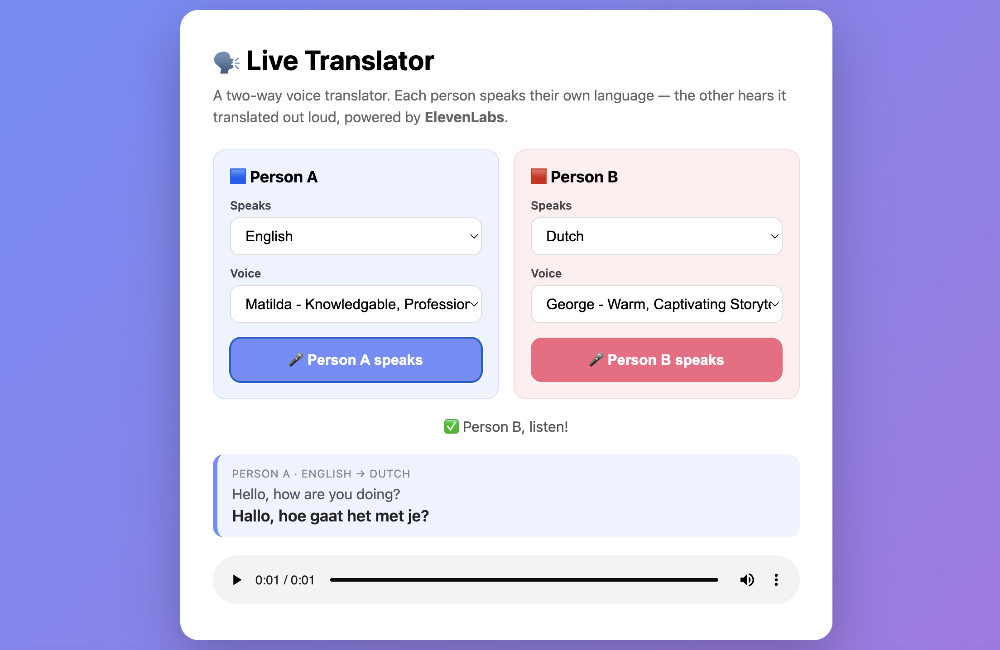
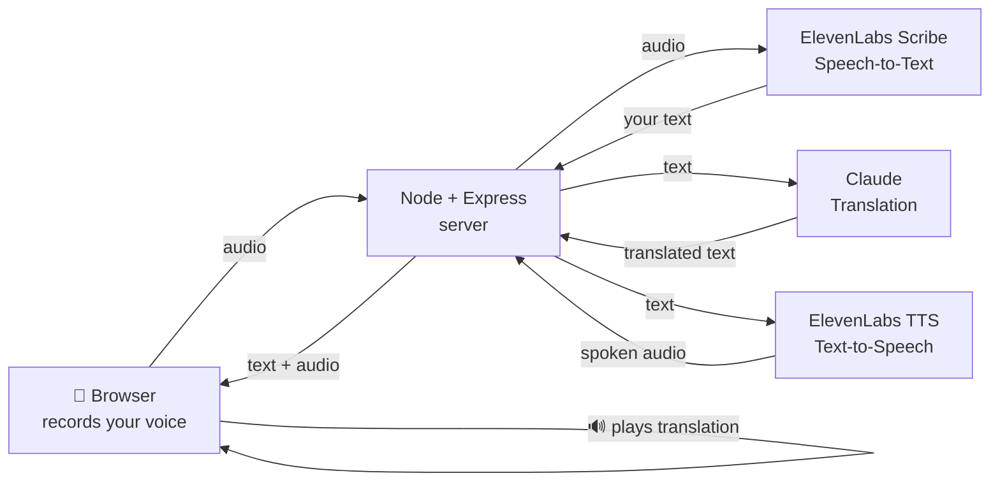

# 🗣️ Live Translator — Multilingual Voice Assistant

Speak into your browser in one language and hear it spoken back in another, in a
natural-sounding voice. Built to showcase **ElevenLabs' multilingual
Speech-to-Text and Text-to-Speech** APIs.



---

## ✨ What it does

A **two-way conversation tool** for two people who don't share a language. Each
person picks their own language and voice:

- **Person A speaks** → it's translated into **Person B's** language and read
  aloud in Person B's voice.
- **Person B speaks back** → it's translated into **Person A's** language and
  read aloud in Person A's voice.

Every turn, behind the scenes:

1. ElevenLabs **Scribe** converts the speech to text.
2. **Claude** translates it into the *other* person's language.
3. ElevenLabs **Text-to-Speech** speaks the translation in a natural voice.

A running transcript shows the whole conversation. All in a few seconds, right
in the browser.

---

## 🏗️ Architecture



Plain-text version of the same flow:

```
🎤 You speak
      │
      ▼
Browser  ──audio──▶  Server  ──audio──▶  ElevenLabs Scribe (Speech-to-Text)
                        │                         │
                        │◀──────  your text  ─────┘
                        │
                        ├──text──▶  Claude (Translation)
                        │◀── translated text ──┘
                        │
                        ├──text──▶  ElevenLabs TTS (Text-to-Speech)
                        │◀── spoken audio ──┘
                        │
                        ▼
Browser  ◀── text + audio ──  🔊 plays the translation
```

**Tech used:** Node.js, Express, vanilla HTML/CSS/JS, the
[ElevenLabs API](https://elevenlabs.io/docs) (Scribe + TTS), and the
[Anthropic Claude API](https://docs.anthropic.com).

---

## 🚀 Run it on your own computer

You only need to do steps 1–2 once.

### 1. Install Node.js
Download the **LTS** version from [nodejs.org](https://nodejs.org) and install it.
To check it worked, open a terminal and run:
```bash
node --version
```
You should see something like `v20.x.x`.

### 2. Get your two API keys
- **ElevenLabs:** sign up at [elevenlabs.io](https://elevenlabs.io) → click your
  profile → **API Keys** → copy the key.
- **Anthropic (Claude):** sign up at
  [console.anthropic.com](https://console.anthropic.com) → **API Keys** →
  **Create Key** → copy it.

### 3. Add your keys
Make a copy of `.env.example` and name the copy `.env`, then paste your keys in:
```bash
cp .env.example .env
```
Open `.env` in a text editor and fill in both keys.

### 4. Install the project's dependencies
From this folder, run:
```bash
npm install
```

### 5. Start the app
```bash
npm start
```
Open **http://localhost:3000** in your browser, allow microphone access, pick a
language and a voice, and start talking. 🎉

---

## 💡 Ideas to extend it

- Show the **detected source language** (Scribe returns it as `language_code`).
- Let users **upload an audio file** instead of recording live.
- **Stream** the audio so playback starts sooner.
